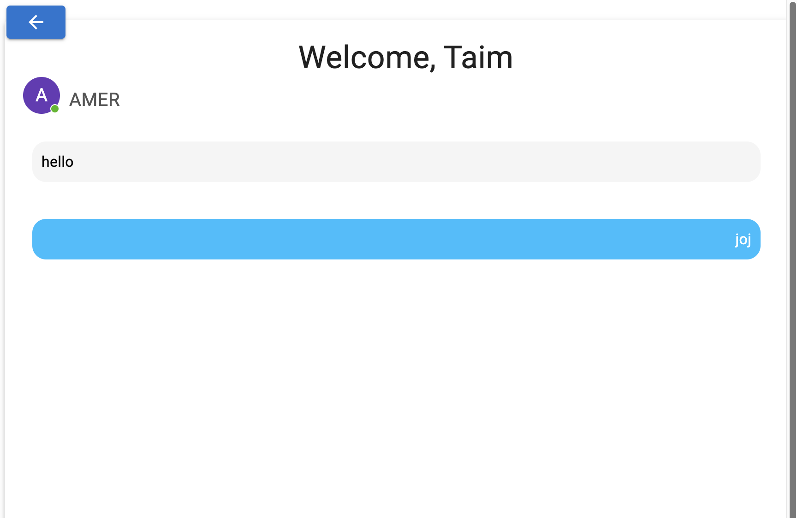

# Application Overview

## Introduction

The application is a web-based application that allows users to chat with each other in real-time. The application provides features such as authentication, chat functionality, and user profiles.

## Page Structure

The application is structured using React Router. The application has three main components: `MainPage`, `Chats`, and `ProfilePage`.

### `MainPage`

The `MainPage` component is the landing page of the application. It renders either the `Login` or `SignUp` component depending on whether the user is authenticated or not.

### `Chats`

The `Chats` component is used to display chat messages between two users. It uses the `socket.io` library to establish real-time communication between the two users.

### `ProfilePage`

The `ProfilePage` component is used to display user profiles. It uses the `socket.io` library to establish real-time communication between the user and other users.

## Page Description
The page represents a routing configuration using React Router for a web application. Below are the routes and their corresponding components:

- **Route `/` and `/login`:**
  - Renders the `MainPage` component if the user is authenticated, otherwise, renders the `Login` component.
  
- **Route `/signup`:**
  - Renders the `MainPage` component if the user is authenticated, otherwise, renders the `SignUp` component.

- **Route `/chat/:userId`:**
  - Renders the `Chats` component, providing a chat interface where users can exchange messages in real-time.

- **Route `/profile/:id`:**
  - Renders the `ProfilePage` component, displaying user profiles based on the provided ID parameter.

## Features
- **Authentication:** Users can log in or sign up to access the application's features.
- **Main Dashboard:** Authenticated users are directed to the main dashboard (`MainPage`) where they can access various features and functionalities.
- **Chat Functionality:** Users can initiate one-on-one chats with other users via the `Chats` component.
- **User Profiles:** Accessible via the `ProfilePage` component, users can view their own profile or profiles of other users.

## Screenshots

### Main Dashboard

### Chat Interface

### User Profile Page

### Login Page

### Sign Up Page
